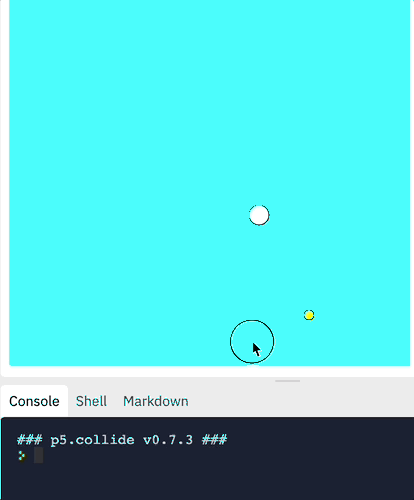
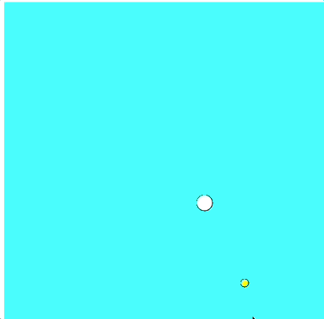
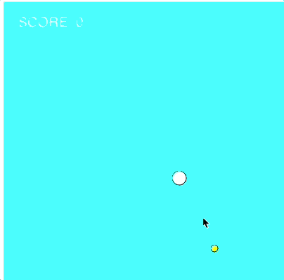
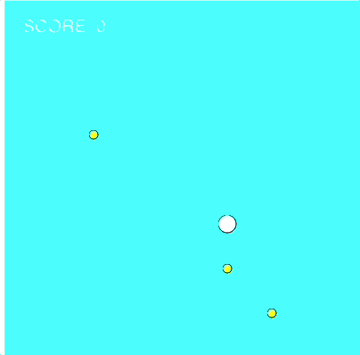
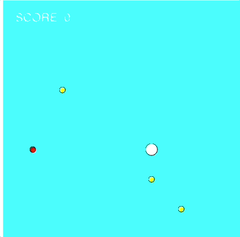

# Collisions

p5.collide2D provides tools for calculating collision detection for 2D geometry with p5.js. Rather than writing functions for all types of situations, we can use the building in functions found in [this library](https://github.com/bmoren/p5.collide2D).

For example, to check if two circles are touching and chagnge them red if they are, we can do the following:

```javascript
var hit = false;

function draw() {
  background(255);
  circle(200, 200, 100);
  circle(mouseX, mouseY, 150);

  hit = collideCircleCircle(mouseX, mouseY, 150, 200, 200, 100);
	if(hit){
		fill("red")
	} 
	else {
		fill("white")
	}
}
```


## Tasks
1. Draw the coin and the bubble on the screen using the values stored in the variables.

2. Using the `collideCircleCircle()` command from p5.collide2D, check to see if the two circles are touching. If the circles are touching, print the message `"TOUCHING"` to the console.



3. Create a function called `randomLocation(coin)` that takes in the coin as a parameter and sets the x and y to a new location. Call the function when the two circles are touching.



4. A sound has been loaded called `found.wav`. Play this sound whenever the use collects the coin.

5. Keep track of the score. Update the score whenever you collect a coin. Display this score on the screen.



6. Create 5 more coins and have them change location on the screen when they are collected



7. Create fake coins that either decrease the score or end the game. If the user touches these coins, you should play a different noise than the `found.wav` you use for the good coins.


